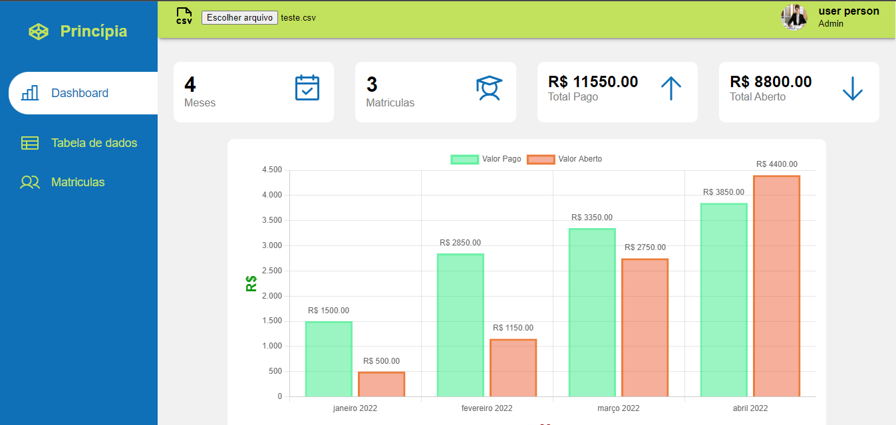
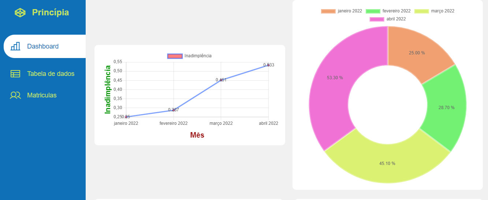

<h1 align="center"> Dashboard</h>
 

  <a href="#-tecnologias">Tecnologias</a>&nbsp;&nbsp;&nbsp;|&nbsp;&nbsp;&nbsp;
  <a href="#-projeto">Projeto</a>&nbsp;&nbsp;&nbsp;|&nbsp;&nbsp;&nbsp;
  <a href="#-layout">Layout</a>&nbsp;&nbsp;&nbsp;|&nbsp;&nbsp;&nbsp;
  <a href="#memo-licença">Licença</a>

  

 

  
  

## 🚀 Tecnologias

Esse projeto foi desenvolvido com as seguintes tecnologias:

- HTML e CSS
- React JS, JavaScript
- Git e Github
- Vercel

## 💻 Projeto
Aplicação desenvolvida como solução do caso prática proposto pela Princípia. Com upload de um arquivo .csv, é gerada uma dashboard contendo as principais informaçóes do arquivo.

## 🔖 Layout

Baseado em ideias do desenvolvedor.

## 📝 Licença

Esse projeto está sob a licença MIT.

---

by Mattheus Adhonnay : Engenheiro de Computação; Desenvolvedor Front-end Jr. [https://www.linkedin.com/in/adhmattheus/]
